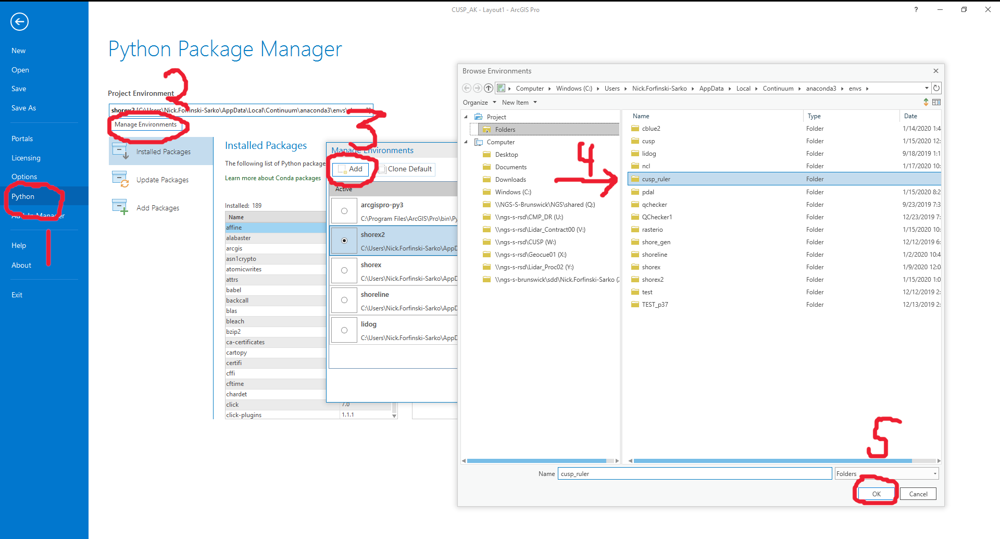

Shoreline Attributer
--------------------

Shoreline Attributer is an ArcPro Python tool that attributes line features according to a subset of the CUSP schema.

Installation
============

Installing Shoreline Attributer consists of 2 main steps:

1. create/configure ArcPro Python environment

2. obtain/load Shoreline Attributer toolbox

1. create/configure ArcPro Python environment
+++++++++++++++++++++++++++++++++++++++++++++

1.1 Creat Python Environment
----------------------------

Clone the default ArcPro Python environment by issueing the following command at an Anaconda prompt:
::

  conda create --clone "C:\Program Files\ArcGIS\Pro\bin\Python\envs\arcgispro-py3" --prefix C:\Users\<user>\AppData\Local\Continuum\anaconda3\envs\shore_att
  
1.2 Install additional Python packages
----------------------------------------

Type the following command at the Anaconda prompt:
::  

  conda install fiona geopandas
  
  
1.3 Configure ArcPro
---------------------------------------

Point ArcPro to the newly created CUSP Ruler Python environment, as shown below:

2. obtain/load Shoreline Attributer toolbox
+++++++++++++++++++++++++++++++++++++++++++
